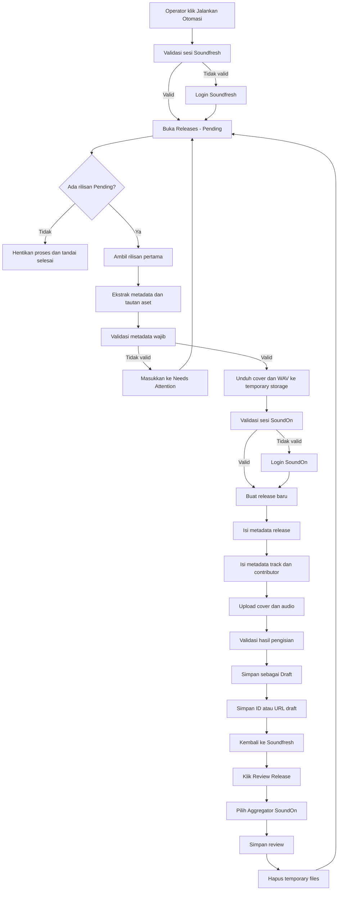

# SOUNDON RELEASE AUTOMATION
## Laravel + MySQL + Browser Automation Specification for Codex

> Dokumen implementasi sistem otomatis pemindahan metadata dan aset rilisan dari Soundfresh CMS ke SoundOn, menyimpan rilisan sebagai **Draft**, lalu memperbarui status rilisan di Soundfresh melalui aksi **Review Release** dengan aggregator **SoundOn**.

---

## 1. Tujuan Sistem

Membangun aplikasi internal berbasis Laravel yang:

1. Login ke Soundfresh CMS menggunakan sesi tersimpan.
2. Membuka halaman `https://cms.soundfresh.id/admin/releases`.
3. Memilih tab **Pending**.
4. Mengambil semua rilisan pending satu per satu.
5. Membaca metadata, cover art, dan file audio WAV dari detail rilisan.
6. Login ke SoundOn menggunakan sesi tersimpan.
7. Membuat rilisan baru di SoundOn.
8. Mengisi metadata SoundOn berdasarkan metadata Soundfresh.
9. Mengunggah cover art dan seluruh audio.
10. Menyimpan rilisan di SoundOn sebagai **Draft**, bukan submit distribusi.
11. Kembali ke Soundfresh.
12. Menjalankan **Review Release**.
13. Memilih aggregator **SoundOn**.
14. Menyimpan hasil review.
15. Melanjutkan rilisan berikutnya.
16. Berhenti otomatis ketika tab Pending sudah kosong.

---

## 2. Aturan Keamanan Wajib

### 2.1 Jangan menulis password di source code

Kredensial tidak boleh ditulis di:

- Repository Git.
- File Markdown.
- Database dalam bentuk plaintext.
- Log aplikasi.
- Screenshot.
- Queue payload.
- Browser console.

Gunakan `.env` hanya pada server:

```dotenv
SOUNDFRESH_BASE_URL=https://cms.soundfresh.id
SOUNDFRESH_RELEASES_URL=https://cms.soundfresh.id/admin/releases
SOUNDFRESH_EMAIL=
SOUNDFRESH_PASSWORD=

SOUNDON_BASE_URL=https://www.soundon.global
SOUNDON_LOGIN_URL=https://www.soundon.global/login?lang=en
SOUNDON_EMAIL=
SOUNDON_PASSWORD=

AUTOMATION_ENCRYPTION_KEY=
PLAYWRIGHT_SERVICE_URL=http://127.0.0.1:3100
```

Tambahkan seluruh file sesi ke `.gitignore`:

```gitignore
.env
storage/app/automation/sessions/*
storage/app/automation/downloads/*
storage/app/automation/screenshots/*
storage/app/automation/traces/*
```

### 2.2 Penyimpanan sesi

Sistem harus mendukung dua metode:

1. **Login otomatis** menggunakan email dan password dari `.env`.
2. **Reuse cached session** menggunakan Playwright `storageState`.

Prioritas login:

```text
Valid cached session
        ↓ tidak valid
Login menggunakan credential
        ↓ berhasil
Simpan storageState terenkripsi
```

Cookie atau token sesi harus:

- Dienkripsi menggunakan Laravel Crypt.
- Tidak ditampilkan di dashboard.
- Memiliki waktu kedaluwarsa.
- Dihapus saat logout atau sesi ditolak.
- Tidak dikirim ke log.

### 2.3 CAPTCHA dan 2FA

Sistem tidak boleh mencoba membypass CAPTCHA atau 2FA.

Jika muncul CAPTCHA, OTP, verifikasi perangkat, atau challenge keamanan:

1. Ubah job menjadi `waiting_manual_auth`.
2. Ambil screenshot.
3. Tampilkan notifikasi di dashboard.
4. Operator menyelesaikan login melalui browser interaktif.
5. Simpan sesi baru.
6. Lanjutkan queue dari checkpoint terakhir.

### 2.4 Rotasi password

Password akun yang pernah dibagikan melalui chat atau media lain harus segera diganti sebelum sistem dipakai di production.

---

## 3. Stack Teknologi

### Aplikasi utama

- PHP 8.3+
- Laravel 12
- Laravel Blade + Livewire 3
- Tailwind CSS
- Alpine.js
- MySQL 8 / MariaDB 10.6+
- Redis
- Laravel Horizon
- Laravel Scheduler
- Laravel Notifications
- Spatie Laravel Permission

### Browser automation

Gunakan **Playwright** sebagai worker browser.

Walaupun aplikasi utama seluruhnya Laravel, Playwright dijalankan sebagai service lokal internal karena lebih stabil untuk:

- SPA dinamis.
- Upload file.
- Multi-tab browser.
- Session storage.
- Network interception.
- Trace viewer.
- Selector berbasis role dan label.
- Screenshot otomatis.

Komponen:

```text
Laravel Web App
    |
    +-- MySQL
    +-- Redis / Horizon
    +-- Automation Orchestrator
            |
            +-- HTTP localhost
                    |
                    +-- Playwright Worker
                            +-- Chromium persistent context
                            +-- Soundfresh session
                            +-- SoundOn session
```

Playwright service tidak boleh dibuka ke internet. Bind ke `127.0.0.1`.

---

## 4. Prinsip Otomasi

### 4.1 Draft only

Sistem hanya boleh:

- Membuat rilisan.
- Mengisi metadata.
- Mengunggah aset.
- Menyimpan sebagai draft.

Sistem tidak boleh menekan tombol:

- Submit.
- Distribute.
- Send for review.
- Publish.
- Release now.

Tambahkan guard:

```php
if ($targetAction !== TargetAction::SAVE_DRAFT) {
    throw new DangerousAutomationActionException();
}
```

### 4.2 Idempotency

Satu rilisan Soundfresh tidak boleh membuat lebih dari satu draft SoundOn.

Idempotency key:

```text
soundfresh:{release_id}:soundon
```

Sebelum membuat draft:

1. Cari mapping lokal.
2. Jika sudah ada `soundon_draft_id`, jangan membuat draft baru.
3. Buka draft yang ada dan validasi.
4. Lanjutkan dari checkpoint terakhir.

### 4.3 Checkpoint

Setiap rilisan memiliki tahapan:

```text
discovered
metadata_extracted
assets_downloaded
soundon_draft_created
metadata_filled
assets_uploaded
draft_saved
soundfresh_reviewed
completed
```

Jika job gagal, ulangi dari checkpoint terakhir, bukan dari awal.

---

## 5. Flow Utama



---

## 6. Simulasi Proses

### Kondisi awal

Tab Pending berisi:

| Urutan | Release ID | Judul | Track |
|---:|---:|---|---:|
| 1 | 4512 | Contoh Single A | 1 |
| 2 | 4513 | Contoh EP B | 5 |

### Simulasi rilisan 4512

```text
[01] Membuka Soundfresh.
[02] Cached session ditemukan dan masih valid.
[03] Membuka /admin/releases.
[04] Memilih tab Pending.
[05] Menemukan release ID 4512.
[06] Membuka detail release.
[07] Mengekstrak metadata.
[08] Mengunduh cover art.
[09] Mengunduh audio WAV.
[10] Memvalidasi file.
[11] Membuka SoundOn.
[12] Cached session SoundOn masih valid.
[13] Membuat release Single.
[14] Mengisi metadata release.
[15] Mengisi metadata track.
[16] Mengunggah cover.
[17] Mengunggah WAV.
[18] Menyimpan sebagai Draft.
[19] Menyimpan URL draft ke database lokal.
[20] Kembali ke Soundfresh.
[21] Menekan Review Release.
[22] Memilih aggregator SoundOn.
[23] Menyimpan review.
[24] Menghapus file temporary.
[25] Status job completed.
```

Proses mengulang release ID 4513. Setelah itu halaman Pending diperiksa ulang. Jika tidak ada data, run dihentikan dengan status `completed_no_pending_release`.

---

## 7. Metadata Mapping

Mapping wajib disimpan dalam database agar dapat diubah tanpa mengubah kode.

### 7.1 Release-level mapping

| Soundfresh | SoundOn | Aturan |
|---|---|---|
| Release title | Release title | Salin apa adanya setelah trim |
| Version | Version | Jangan menggandakan versi pada judul |
| Primary artist | Primary artist | Cocokkan/create sesuai UI |
| Featuring artist | Featuring artist | Pisahkan dari primary artist |
| Release type | Single/EP/Album | Gunakan jumlah track dan metadata sumber |
| Label | Label name | Salin |
| Copyright C line | C line | Pertahankan tahun dan pemilik |
| Phonographic P line | P line | Pertahankan tahun dan pemilik |
| Original release date | Original release date | Format ISO |
| New release date | Release date | Validasi batas minimum SoundOn |
| UPC/EAN | UPC | Isi hanya jika tersedia dan diterima |
| Genre | Primary genre | Gunakan mapping lokal |
| Subgenre | Secondary genre | Opsional |
| Language | Metadata language | Mapping ISO |
| Cover art | Cover art | Unduh sementara lalu upload |
| Explicit | Explicit flag | Boolean |
| Previously released | Previously released | Boolean |
| Territory | Territory | Default sesuai konfigurasi |

### 7.2 Track-level mapping

| Soundfresh | SoundOn | Aturan |
|---|---|---|
| Track title | Track title | Trim |
| Track version | Version | Jangan masukkan dua kali |
| Primary artist | Primary artist | Wajib |
| Featuring artist | Featuring artist | Opsional |
| ISRC | ISRC | Isi jika existing |
| Audio WAV | Audio master | Upload WAV |
| Composer | Composer | Nama asli sesuai data |
| Author/Lyricist | Lyricist | Nama asli sesuai data |
| Producer | Producer | Opsional |
| Arranger | Arranger | Opsional |
| Publisher | Publisher | Opsional |
| Explicit | Explicit | Per track |
| Instrumental | Instrumental | Boolean |
| Language | Lyrics language | Mapping |
| Preview start | Preview setting | Hanya jika field tersedia |
| Track number | Track sequence | Pertahankan urutan |

### 7.3 Genre mapping

Contoh tabel:

```text
Pop Indonesia       -> Pop
Pop Melayu          -> Pop
Rock Alternative    -> Rock / Alternative
Dangdut             -> World / Dangdut
Religi               -> Religious
Hip Hop              -> Hip-Hop/Rap
Electronic          -> Electronic
Jazz                 -> Jazz
```

Jika genre tidak mempunyai mapping:

- Jangan menebak.
- Tandai rilisan `needs_attention`.
- Operator memilih mapping.
- Simpan mapping baru untuk penggunaan berikutnya.

---

## 8. Validasi Metadata

Sebelum membuka SoundOn, jalankan validator.

### Release

- Judul tidak kosong.
- Primary artist tersedia.
- Tipe rilisan valid.
- Cover tersedia.
- Tanggal rilis valid.
- P line dan C line valid.
- Minimal satu track.
- Tidak ada track duplikat.
- UPC valid jika diisi.

### Track

- Judul tersedia.
- Audio tersedia.
- WAV dapat dibaca.
- Bit depth minimal sesuai kebijakan internal.
- Sample rate terbaca.
- ISRC valid jika tersedia.
- Composer/author tersedia bila diwajibkan.
- Artist role konsisten.
- Explicit flag tersedia.

### File

Jalankan `ffprobe`:

```bash
ffprobe -v quiet -print_format json -show_format -show_streams input.wav
```

Simpan hanya hasil teknis, bukan file permanen:

```json
{
  "codec": "pcm_s16le",
  "sample_rate": 44100,
  "channels": 2,
  "bit_depth": 16,
  "duration": 214.52
}
```

---

## 9. Database Schema

### users

```text
id
name
email
password
is_active
last_login_at
timestamps
```

### automation_accounts

```text
id
platform enum: soundfresh,soundon
name
email_encrypted
password_encrypted nullable
session_state_encrypted longtext nullable
session_expires_at nullable
last_authenticated_at nullable
status enum: active,expired,manual_auth_required,disabled
timestamps
```

> Jika kredensial berasal dari `.env`, kolom password boleh selalu null.

### automation_runs

```text
id uuid
triggered_by nullable
status enum:
  queued,running,paused,completed,completed_no_pending,
  failed,cancelled,manual_auth_required
started_at nullable
finished_at nullable
pending_found integer default 0
processed integer default 0
completed integer default 0
failed integer default 0
skipped integer default 0
current_release_id nullable
stop_requested_at nullable
summary_json nullable
timestamps
```

### release_jobs

```text
id uuid
automation_run_id
soundfresh_release_id
soundfresh_release_url
soundon_draft_id nullable
soundon_draft_url nullable
idempotency_key unique
release_title nullable
artist_name nullable
release_type nullable
track_count integer default 0
status
checkpoint
attempts integer default 0
error_code nullable
error_message nullable
metadata_snapshot_json nullable
started_at nullable
finished_at nullable
timestamps
```

### release_assets

```text
id
release_job_id
type enum: cover,audio
track_position nullable
source_url_encrypted nullable
temporary_path nullable
original_filename
mime_type nullable
file_size nullable
checksum_sha256 nullable
validation_json nullable
uploaded_to_soundon_at nullable
deleted_at_source_cache nullable
timestamps
```

### metadata_mappings

```text
id
mapping_type enum: genre,language,role,country,release_type
source_value
target_value
is_active
created_by nullable
timestamps
unique(mapping_type, source_value)
```

### automation_events

```text
id
automation_run_id nullable
release_job_id nullable
level enum: debug,info,warning,error,critical
event
message
context_json nullable
created_at
```

### automation_artifacts

```text
id
automation_run_id nullable
release_job_id nullable
type enum: screenshot,trace,html_snapshot
path
expires_at
created_at
```

---

## 10. Laravel Domain Structure

```text
app/
├── Actions/
│   └── Automation/
│       ├── StartAutomationRun.php
│       ├── StopAutomationRun.php
│       ├── ResumeAutomationRun.php
│       ├── ValidateReleaseMetadata.php
│       └── CleanupTemporaryAssets.php
├── DTO/
│   ├── ReleaseMetadataData.php
│   ├── TrackMetadataData.php
│   └── AutomationResultData.php
├── Enums/
│   ├── AutomationRunStatus.php
│   ├── ReleaseJobStatus.php
│   ├── ReleaseCheckpoint.php
│   └── Platform.php
├── Jobs/
│   ├── DiscoverPendingReleasesJob.php
│   ├── ProcessReleaseJob.php
│   ├── ExtractSoundfreshMetadataJob.php
│   ├── DownloadReleaseAssetsJob.php
│   ├── CreateSoundOnDraftJob.php
│   ├── ReviewSoundfreshReleaseJob.php
│   └── CleanupReleaseAssetsJob.php
├── Models/
├── Services/
│   ├── Automation/
│   │   ├── PlaywrightClient.php
│   │   ├── SessionManager.php
│   │   └── SelectorRegistry.php
│   ├── Soundfresh/
│   │   ├── SoundfreshClient.php
│   │   ├── SoundfreshMetadataParser.php
│   │   └── SoundfreshReleaseReviewer.php
│   └── SoundOn/
│       ├── SoundOnClient.php
│       ├── SoundOnMetadataMapper.php
│       └── SoundOnDraftCreator.php
└── Livewire/
    └── Automation/
        ├── Dashboard.php
        ├── RunDetail.php
        ├── ReleaseJobDetail.php
        ├── AccountSession.php
        └── MetadataMapping.php
```

---

## 11. Playwright Worker Structure

```text
automation-worker/
├── src/
│   ├── server.ts
│   ├── browser/
│   │   ├── context-manager.ts
│   │   ├── session-store.ts
│   │   └── screenshot.ts
│   ├── soundfresh/
│   │   ├── login.ts
│   │   ├── releases.ts
│   │   ├── release-detail.ts
│   │   └── review-release.ts
│   ├── soundon/
│   │   ├── login.ts
│   │   ├── create-release.ts
│   │   ├── fill-release.ts
│   │   ├── upload-assets.ts
│   │   └── save-draft.ts
│   ├── selectors/
│   │   ├── soundfresh.ts
│   │   └── soundon.ts
│   └── contracts/
│       └── api.ts
├── storage/
│   ├── sessions/
│   ├── downloads/
│   ├── screenshots/
│   └── traces/
└── package.json
```

---

## 12. Internal API Laravel → Playwright

Semua endpoint:

- Hanya bind localhost.
- Gunakan HMAC signature.
- Gunakan timestamp dan nonce.
- Tolak request lebih dari 60 detik.
- Jangan menerima action arbitrary.

### Endpoints

```http
POST /v1/sessions/validate
POST /v1/sessions/login
POST /v1/soundfresh/pending
POST /v1/soundfresh/releases/extract
POST /v1/soundfresh/releases/review
POST /v1/soundon/drafts/create
POST /v1/soundon/drafts/fill
POST /v1/soundon/drafts/upload
POST /v1/soundon/drafts/save
GET  /v1/jobs/{jobId}
POST /v1/jobs/{jobId}/cancel
```

Contoh request:

```json
{
  "job_id": "uuid",
  "platform": "soundfresh",
  "action": "list_pending_releases",
  "options": {
    "max_items": 50
  }
}
```

Contoh response:

```json
{
  "success": true,
  "data": {
    "items": [
      {
        "release_id": "4512",
        "title": "Contoh Single",
        "detail_url": "https://cms.soundfresh.id/admin/releases/4512"
      }
    ],
    "has_more": false
  }
}
```

---

## 13. Selector Strategy

Jangan mengandalkan selector CSS rapuh seperti:

```css
div:nth-child(4) > button:nth-child(2)
```

Urutan selector:

1. `getByRole()`
2. `getByLabel()`
3. `getByText()` dengan exact.
4. `data-testid` jika tersedia.
5. CSS stabil.
6. XPath hanya sebagai pilihan terakhir.

Contoh:

```ts
await page.getByRole('tab', { name: /pending/i }).click();
await page.getByRole('button', { name: /review release/i }).click();
await page.getByLabel(/aggregator/i).selectOption({ label: 'SoundOn' });
```

Buat registry agar selector dapat diperbarui tanpa mengubah business logic.

---

## 14. Discovery Pending Releases

Pseudocode:

```php
public function handle(): void
{
    $run = AutomationRun::findOrFail($this->runId);

    while (! $run->stop_requested_at) {
        $items = $this->soundfresh->getPendingReleases();

        if (count($items) === 0) {
            $run->markCompletedNoPending();
            return;
        }

        foreach ($items as $item) {
            ProcessReleaseJob::dispatch($run->id, $item)
                ->onQueue('release-automation');
        }

        return;
    }
}
```

Jangan queue seluruh katalog tanpa batas. Gunakan batch kecil, misalnya 10 rilisan, lalu periksa ulang tab Pending.

---

## 15. Processing Pipeline

```php
Bus::chain([
    new ExtractSoundfreshMetadataJob($releaseJobId),
    new DownloadReleaseAssetsJob($releaseJobId),
    new CreateSoundOnDraftJob($releaseJobId),
    new FillSoundOnMetadataJob($releaseJobId),
    new UploadSoundOnAssetsJob($releaseJobId),
    new SaveSoundOnDraftJob($releaseJobId),
    new ReviewSoundfreshReleaseJob($releaseJobId),
    new CleanupReleaseAssetsJob($releaseJobId),
])->catch(function (Throwable $e) use ($releaseJobId) {
    ReleaseJob::find($releaseJobId)?->markFailed($e);
})->dispatch();
```

Gunakan queue concurrency `1` sebagai default agar:

- Sesi browser tidak bentrok.
- Tidak terjadi duplicate draft.
- Upload besar tidak memenuhi bandwidth.
- Rate limit lebih aman.

Concurrency dapat dinaikkan setelah pengujian.

---

## 16. Review Release di Soundfresh

Review hanya dijalankan jika semua kondisi berikut benar:

```text
SoundOn draft berhasil dibuat
AND seluruh metadata wajib terisi
AND seluruh audio selesai upload
AND cover selesai upload
AND tombol Save Draft berhasil
AND draft ID atau draft URL tersimpan
```

Prosedur:

1. Buka detail rilisan Soundfresh.
2. Klik tombol **Review Release**.
3. Tunggu modal/form tampil.
4. Pilih aggregator **SoundOn**.
5. Isi catatan otomatis, bila tersedia:

```text
SoundOn draft created automatically.
Automation job: {job_uuid}
Draft reference: {soundon_draft_id}
```

6. Klik simpan/konfirmasi.
7. Verifikasi status rilisan tidak lagi Pending.
8. Simpan screenshot bukti.

Jika status masih Pending, job tidak boleh dianggap completed.

---

## 17. Dashboard

### Ringkasan

Card:

- Pending ditemukan.
- Sedang diproses.
- Draft berhasil.
- Needs Attention.
- Gagal.
- Sesi perlu login.
- Rata-rata waktu per rilisan.

### Tombol

- Jalankan otomasi.
- Stop setelah rilisan aktif selesai.
- Pause.
- Resume.
- Refresh session Soundfresh.
- Refresh session SoundOn.
- Retry failed.
- Buka draft SoundOn.
- Buka release Soundfresh.

### Tabel job

Kolom:

```text
Release ID
Judul
Artis
Tipe
Jumlah track
Checkpoint
Status
SoundOn draft
Percobaan
Durasi
Error
Aksi
```

### Needs Attention

Tampilkan:

- Metadata yang hilang.
- Genre belum dipetakan.
- Contributor tidak valid.
- File gagal.
- CAPTCHA/OTP.
- Perubahan UI/selector.
- Draft duplikat.
- Tanggal rilis tidak diterima.

---

## 18. Error Handling

### Kategori error

```text
AUTH_SESSION_EXPIRED
AUTH_CAPTCHA_REQUIRED
AUTH_OTP_REQUIRED
SOUNDFRESH_UI_CHANGED
SOUNDON_UI_CHANGED
NO_PENDING_RELEASE
METADATA_MISSING
METADATA_MAPPING_MISSING
ASSET_DOWNLOAD_FAILED
AUDIO_INVALID
COVER_INVALID
UPLOAD_FAILED
DRAFT_SAVE_FAILED
DRAFT_REFERENCE_NOT_FOUND
SOUNDFRESH_REVIEW_FAILED
RATE_LIMITED
NETWORK_TIMEOUT
DUPLICATE_DETECTED
```

### Retry policy

| Error | Retry |
|---|---:|
| Network timeout | 3 kali, exponential backoff |
| Upload failed | 3 kali |
| Session expired | Login ulang 1 kali |
| CAPTCHA/OTP | Tidak retry otomatis |
| Metadata missing | Tidak retry |
| UI changed | Tidak retry tanpa selector update |
| Review failed | 2 kali setelah verifikasi draft |
| Duplicate detected | Jangan membuat draft baru |

Backoff:

```text
30 detik
2 menit
10 menit
```

---

## 19. File Lifecycle

```text
Download dari Soundfresh
        ↓
storage/app/automation/downloads/{job_uuid}
        ↓
Checksum dan validasi
        ↓
Upload SoundOn
        ↓
Verifikasi upload berhasil
        ↓
Simpan draft
        ↓
Review Soundfresh
        ↓
Hapus file lokal
```

Aturan:

- File temporary maksimal disimpan 24 jam saat job gagal.
- Scheduler menghapus file kedaluwarsa.
- Jangan menyimpan WAV sebagai arsip permanen.
- Jangan expose storage melalui public URL.
- Gunakan random filename.
- Validasi MIME dan signature file.

---

## 20. Audit dan Observability

Simpan event bisnis, bukan rahasia.

Contoh aman:

```json
{
  "event": "soundon_draft_saved",
  "release_job_id": "uuid",
  "soundfresh_release_id": "4512",
  "track_count": 1,
  "duration_ms": 128432
}
```

Jangan log:

- Password.
- Cookie.
- Access token.
- Signed download URL.
- Isi session storage.
- Isi lengkap halaman yang mengandung data sensitif.

Artifacts:

- Screenshot sebelum action penting.
- Screenshot setelah draft tersimpan.
- Screenshot setelah Soundfresh direview.
- Playwright trace hanya saat gagal.
- Retensi default 7 hari.

---

## 21. Scheduler

```php
Schedule::command('automation:cleanup')
    ->hourly()
    ->withoutOverlapping();

Schedule::command('automation:expire-artifacts')
    ->dailyAt('02:00');

Schedule::command('automation:session-health')
    ->everyThirtyMinutes()
    ->withoutOverlapping();
```

Proses upload sebaiknya dijalankan manual dari dashboard pada tahap awal.

Setelah stabil, mode otomatis dapat menggunakan schedule:

```php
Schedule::command('soundon:process-pending')
    ->everyTenMinutes()
    ->withoutOverlapping()
    ->onOneServer();
```

Tambahkan feature flag:

```dotenv
AUTOMATION_SCHEDULE_ENABLED=false
```

---

## 22. Artisan Commands

```bash
php artisan soundon:session:login soundfresh
php artisan soundon:session:login soundon
php artisan soundon:session:check
php artisan soundon:pending:list
php artisan soundon:process-pending --limit=1 --dry-run
php artisan soundon:process-pending --limit=10
php artisan soundon:retry {releaseJobId}
php artisan soundon:cleanup
```

### Dry run

Mode `--dry-run` wajib tersedia.

Dry run:

- Login.
- Membuka Pending.
- Membaca metadata.
- Memvalidasi mapping.
- Tidak membuat draft.
- Tidak upload.
- Tidak mengubah Soundfresh.

---

## 23. Tahapan Implementasi Codex

### Fase 1 — Foundation

- Buat Laravel project.
- Konfigurasi MySQL.
- Pasang Livewire, Tailwind, Redis, Horizon, Spatie Permission.
- Buat migration dan enum.
- Buat dashboard dasar.
- Buat audit event.

### Fase 2 — Browser worker

- Buat Playwright service.
- Persistent browser contexts terpisah.
- Session validation.
- Manual interactive login.
- Screenshot dan trace.
- HMAC internal API.

### Fase 3 — Soundfresh read-only

- Login.
- Buka tab Pending.
- Pagination/infinite scroll.
- Ekstrak detail rilisan.
- Download aset.
- Dry-run validator.
- Jangan melakukan perubahan.

### Fase 4 — SoundOn draft

- Login.
- Create release.
- Metadata mapping.
- Upload cover.
- Upload multi-track WAV.
- Save draft.
- Capture draft reference.
- Guard terhadap submit.

### Fase 5 — Soundfresh review

- Review Release.
- Pilih SoundOn.
- Verifikasi status.
- Screenshot bukti.
- Idempotency.

### Fase 6 — Reliability

- Retry.
- Checkpoint.
- Resume.
- Needs Attention.
- Session refresh.
- Cleanup.
- Dashboard monitoring.

### Fase 7 — UAT

Uji minimal:

1. Single 1 track.
2. EP 2–6 track.
3. Album lebih dari 6 track.
4. Existing UPC dan ISRC.
5. Rilisan baru tanpa UPC/ISRC.
6. Featuring artist.
7. Multi artist.
8. Explicit.
9. Instrumental.
10. Previously released.
11. Genre belum dipetakan.
12. WAV invalid.
13. Upload terputus.
14. Session expired.
15. CAPTCHA/OTP.
16. Draft sudah pernah dibuat.
17. Soundfresh review gagal.
18. Pending kosong.

---

## 24. Acceptance Criteria

Sistem dianggap selesai jika:

- Login kedua platform dapat menggunakan cached session.
- Session expired dapat ditangani.
- Pending release dapat dideteksi.
- Metadata release dan track dapat diekstrak.
- Cover dan WAV dapat diproses sementara.
- Single, EP, dan Album dapat dibuat di SoundOn.
- Metadata berhasil dipetakan.
- Semua aset berhasil diupload.
- Rilisan disimpan sebagai Draft.
- Tidak ada action submit/distribute.
- Draft ID/URL tersimpan.
- Soundfresh Review Release memilih SoundOn.
- Status Soundfresh terverifikasi berubah.
- Tidak membuat draft duplikat.
- Proses berhenti saat Pending kosong.
- File temporary terhapus.
- Error dapat dilihat dan diretry.
- Tidak ada credential atau cookie di log.
- Dry-run tersedia.
- Audit screenshot tersedia.

---

## 25. Prompt Utama untuk Codex

```text
Kamu adalah Senior Full-Stack Developer dan Automation Engineer.

Bangun aplikasi internal bernama "SoundOn Release Automation" menggunakan:

- PHP 8.3+
- Laravel 12
- Laravel Blade
- Livewire 3
- Alpine.js
- Tailwind CSS
- MySQL
- Redis
- Laravel Horizon
- Spatie Laravel Permission
- Node.js TypeScript Playwright worker sebagai browser automation service lokal

Tujuan aplikasi:
Mengambil semua rilisan pada tab Pending dari halaman admin Soundfresh, menyalin metadata, cover art, dan file WAV ke SoundOn, menyimpan rilisan SoundOn sebagai Draft saja, kemudian kembali ke Soundfresh, klik Review Release, pilih aggregator SoundOn, simpan review, dan mengulang sampai tab Pending kosong.

Ketentuan kritis:
1. Jangan pernah hardcode email, password, cookie, atau token.
2. Gunakan .env dan encrypted cached browser session.
3. Jangan bypass CAPTCHA atau OTP.
4. Jika CAPTCHA/OTP muncul, ubah status menjadi manual_auth_required.
5. SoundOn hanya boleh Save Draft. Jangan pernah Submit, Publish, Send for Review, atau Distribute.
6. Terapkan idempotency agar satu Soundfresh release hanya mempunyai satu SoundOn draft.
7. Terapkan checkpoint per rilisan agar proses dapat dilanjutkan.
8. Gunakan queue concurrency 1 sebagai default.
9. Gunakan temporary private storage untuk cover dan WAV.
10. Hapus file temporary setelah draft dan review berhasil.
11. Buat dry-run read-only.
12. Simpan screenshot bukti dan audit event tanpa rahasia.
13. Playwright worker hanya bind ke 127.0.0.1 dan endpoint ditandatangani HMAC.
14. Seluruh selector browser harus berada di Selector Registry.
15. Prioritaskan getByRole dan getByLabel.
16. Berhenti otomatis jika tab Pending kosong.
17. Buat dashboard Livewire untuk run, job, session, error, mapping, retry, pause, resume, dan stop.
18. Gunakan service classes, DTO, enum, action, jobs, repository bila diperlukan, dan automated tests.
19. Jangan gunakan Prisma.
20. Jangan menyimpan audio secara permanen.

Implementasikan secara bertahap:
- migrations
- models
- enums
- services
- jobs
- Livewire dashboard
- Playwright worker
- internal API
- login/session caching
- Soundfresh pending discovery
- metadata extraction
- SoundOn draft creation
- asset upload
- Soundfresh review
- retry/checkpoint/idempotency
- tests
- Docker Compose development
- deployment guide untuk Plesk/AlmaLinux

Buat kode production-grade, strict typing, validation, exception handling, security headers, audit logging, unit tests, feature tests, dan Playwright integration tests.

Mulai dari struktur proyek dan migration. Setelah setiap fase, jalankan test dan perbaiki error sebelum melanjutkan.
```

---

## 26. Deployment Plesk / AlmaLinux

Service:

```text
nginx/apache -> Laravel
php-fpm
mysql
redis
supervisor -> horizon
systemd -> playwright-worker
chromium dependencies
```

Systemd worker:

```ini
[Unit]
Description=SoundOn Playwright Automation Worker
After=network.target redis.service

[Service]
Type=simple
User=automation
WorkingDirectory=/var/www/vhosts/example.com/automation-worker
ExecStart=/usr/bin/node dist/server.js
Restart=always
RestartSec=5
Environment=NODE_ENV=production

[Install]
WantedBy=multi-user.target
```

Supervisor Horizon:

```ini
[program:soundon-horizon]
process_name=%(program_name)s
command=php /var/www/vhosts/example.com/httpdocs/artisan horizon
autostart=true
autorestart=true
user=example
redirect_stderr=true
stdout_logfile=/var/www/vhosts/example.com/httpdocs/storage/logs/horizon.log
stopwaitsecs=3600
```

Pastikan browser worker memiliki:

- Folder writable.
- Chromium dependencies.
- Batas disk.
- Batas memory.
- Timeout upload yang cukup.
- Akses hanya ke domain yang diizinkan.

---

## 27. Catatan Integrasi Nyata

Karena kedua halaman berada di balik login dan struktur UI dapat berubah, sebelum implementasi selector final lakukan sesi discovery terkontrol:

1. Login manual.
2. Rekam Playwright trace.
3. Identifikasi field dan tombol berdasarkan accessible role.
4. Simpan selector di registry.
5. Jalankan dry-run satu rilisan.
6. Jalankan draft-only satu rilisan.
7. Verifikasi manual.
8. Aktifkan review Soundfresh.
9. Naikkan limit secara bertahap.

Jangan menjalankan batch seluruh Pending pada percobaan pertama.
